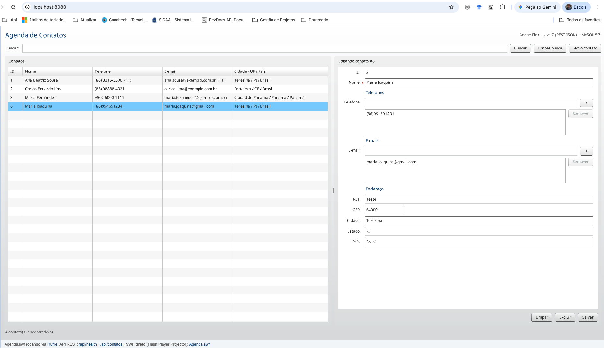

# Agenda de Contatos: Adobe Flex + Java 7 + MySQL 5.7 (Docker)

Esta é uma aplicação CRUD de agenda de contatos na arquitetura clássica de sistemas Flex corporativos:

| Camada | Tecnologia | Container |
|---|---|---|
| Frontend | Adobe Flex (Apache Flex SDK 4.16.1, componentes MX/Halo), `HTTPService` + JSON | `agenda-frontend` (nginx) |
| Backend | Java 7, Servlet 3.0 no Tomcat 7, JDBC puro, Gson | `agenda-backend` (`tomcat:7-jre7`) |
| Banco | MySQL 5.7 | `agenda-db` (`mysql:5.7`) |

Cada contato tem `id`, `nome`, uma lista de telefones, uma lista de e-mails e um endereço (rua, CEP, cidade, estado, país).

```
Navegador ──► http://localhost:8080 (nginx)
                ├── /            index.html + Agenda.swf (Ruffle)
                └── /api/*  ───► backend:8080 (Tomcat 7 / Java 7) ───► db:3306 (MySQL 5.7)
```


## Passo a passo para executar

### 1. Pré-requisitos

- **Docker Desktop** (Windows/macOS) ou **Docker Engine + Compose v2** (Linux). Confira com:
  ```bash
  docker --version          # 20.10 ou superior
  docker compose version    # v2.x
  ```
- Acesso à internet no primeiro build, para baixar as imagens, as dependências do Maven, o Apache Flex SDK e o `playerglobal.swc`.
- Cerca de 3 GB livres em disco.
- As portas **8080**, **8081** e **3307** livres.

> **Macs com Apple Silicon (M1/M2/M3/M4):** as imagens `mysql:5.7` e `tomcat:7-jre7` só existem para amd64. O `docker-compose.yml` já declara `platform: linux/amd64`, e o Docker Desktop as executa por emulação (Rosetta). Se aparecer um erro de plataforma, ative em *Settings → General* a opção *Use Rosetta for x86_64/amd64 emulation on Apple Silicon*.

### 2. Obter o projeto

Disponível em https://github.com/armandossrecife/agenda-contatos

Clone o projeto e entre na pasta:

```bash
cd agenda-contatos
```

### 3. Construir e subir os containers

```bash
docker compose up -d --build
```

O primeiro build leva de 3 a 10 minutos e faz o seguinte:

1. **backend:** o Maven compila o código com bytecode Java 7 (`-source/-target 1.7`), roda os testes JUnit, gera o `agenda-backend.war` e o copia para um Tomcat 7 com JRE 7 como `ROOT.war`.
2. **frontend:** baixa o Apache Flex SDK 4.16.1 e o `playerglobal.swc`, compila `Agenda.mxml` com o `mxmlc` para gerar o `Agenda.swf` e publica esse arquivo no nginx.
3. **db:** sobe o MySQL 5.7 e executa `db/init.sql`, que cria as tabelas e insere 3 contatos de exemplo.

### 4. Acompanhar a inicialização

```bash
docker compose ps                 # "agenda-db" deve ficar (healthy)
docker compose logs -f backend    # espere por "Server startup in ... ms"
```

O backend só inicia depois que o MySQL passa no healthcheck.

### 5. Verificar o backend

Abra no navegador ou use o curl:

```bash
curl http://localhost:8081/api/health
# {"java":"1.7.0_...","servidor":"Apache Tomcat/7.0.x","banco":"MySQL 5.7.x","status":"UP"}

curl http://localhost:8081/api/contatos
```

O campo `"java":"1.7.0_..."` confirma que o backend está rodando em Java 7.

Para testar o CRUD completo pela linha de comando:

```bash
chmod +x testar-api.sh
./testar-api.sh
```

### 6. Abrir a aplicação Flex

Acesse **http://localhost:8080**.

Os navegadores atuais não têm mais o plugin Flash. Por isso, o `index.html` carrega o **[Ruffle](https://ruffle.rs)**, um emulador de Flash Player em WebAssembly, que executa o `Agenda.swf` direto na página.

Na tela:

1. A grade à esquerda lista os contatos. Clique em um deles para carregá-lo no formulário.
2. **Novo contato** limpa o formulário. Preencha o nome e use o botão **+** para adicionar cada telefone e cada e-mail (ou tecle Enter).
3. **Salvar** cria o contato (POST) ou atualiza o que está aberto (PUT).
4. **Excluir** pede confirmação e remove o contato (DELETE).
5. **Buscar** filtra por nome, e-mail ou telefone.

**Alternativa com Flash Player de verdade:** baixe o *Flash Player Projector (content debugger)* na página de downloads de debug da Adobe, abra o projector e use *File → Open* com `http://localhost:8080/Agenda.swf`. Como a URL da API é relativa (`api`), ela aponta para `http://localhost:8080/api`.



### 7. Acessar o banco (opcional)

```bash
docker compose exec db mysql -uagenda -pagenda agenda \
  -e "SELECT c.id, c.nome, t.numero FROM contato c LEFT JOIN contato_telefone t ON t.contato_id = c.id;"
```

Você também pode usar um cliente gráfico (DBeaver, MySQL Workbench) em `localhost:3307`, com usuário `agenda` e senha `agenda`.

### 8. Parar, reiniciar e limpar

```bash
docker compose stop                 # para os containers (os dados ficam)
docker compose start                # sobe de novo
docker compose down                 # remove os containers (os dados ficam no volume)
docker compose down -v              # remove também o volume do MySQL (o init.sql roda de novo)
docker compose up -d --build frontend   # recompila só o frontend depois de editar o MXML
docker compose up -d --build backend    # recompila só o backend depois de editar o Java
```
